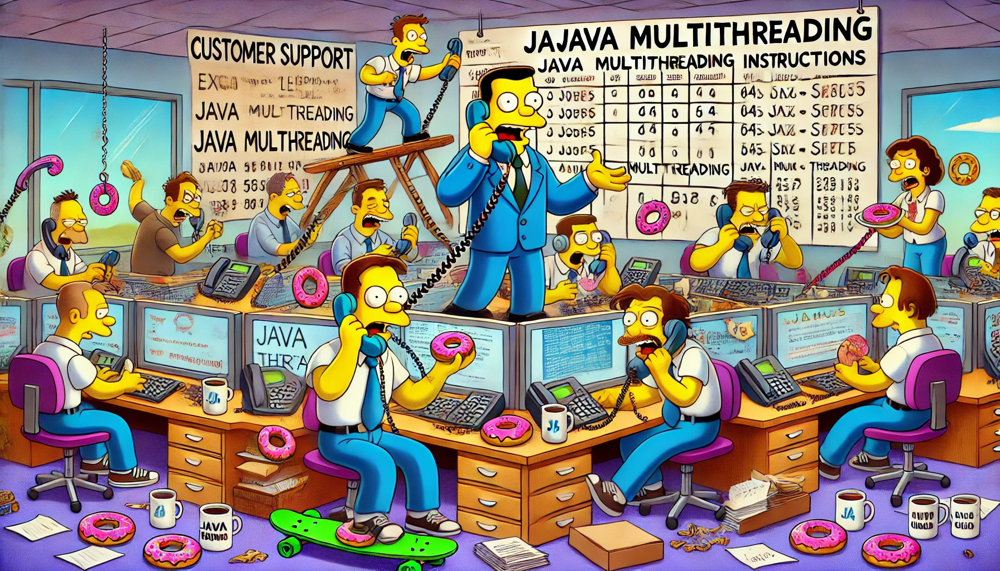
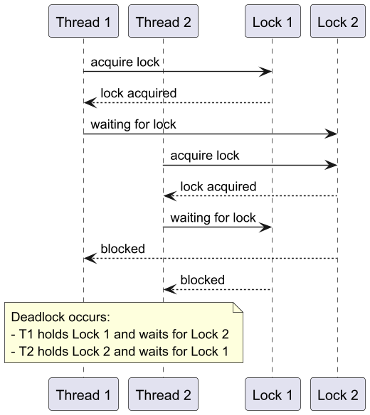

# Многопоточность в Java

## 1. Что такое многопоточность?



Многопоточность позволяет выполнять несколько потоков (независимых задач) одновременно, что увеличивает производительность и отзывчивость приложений. Например:

- Веб-сервера обрабатывают запросы параллельно.
- Игровые приложения одновременно обрабатывают физику, графику и пользовательский ввод.

### Зачем нужна многопоточность?

- Ускорение выполнения задач (параллельная обработка).
- Эффективное выполнение задач, ожидающих ввода/вывода (I/O).

### Устройство потоков в JVM и ОС

- Потоки Java отображаются на нативные потоки операционной системы.
- JVM делегирует ОС управление потоками для планирования и распределения ресурсов.
- Каждый поток имеет:
    - Собственный стек вызовов.
    - Изолированную память для выполнения задач.
- **Потребление памяти потоком:**
    - В Java каждый поток использует память для стека вызовов и других ресурсов.
    - Размер стека потока может варьироваться в зависимости от JVM и операционной системы, но обычно составляет:
        - По умолчанию: от 256 КБ до 1 МБ на поток.
        - Конфигурация: можно изменить с помощью параметра JVM `-Xss` (например, `-Xss512k` для установки 512 КБ на поток).
    - Эта память выделяется отдельно от кучи (`heap`), поэтому большое количество потоков может быстро исчерпать доступную оперативную память.
    - Это одна из причин появления более лёгких виртуальных потоков в Project Loom (Virtual Threads).

## 2. Основы многопоточности в Java

Поток — это независимый путь выполнения кода. Каждый Java-приложение имеет основной поток `main` и может создавать дополнительные потоки.

### Создание потоков

- **Использование класса Thread**
- **Реализация интерфейса Runnable**

#### Пример с использованием Runnable:

```java
class MyRunnable implements Runnable {
    public void run() {
        System.out.println("Hello from a thread!");
    }
}

public class Main {
    public static void main(String[] args) {
        Thread thread = new Thread(new MyRunnable());
        thread.start();
    }
}
```

## 3. Проблемы многопоточности

### Гонка потоков (Race Condition)

- Состояние, при котором результат выполнения программы зависит от порядка выполнения потоков.
- Возникает, если два и более потока одновременно изменяют общий ресурс без синхронизации.
- **Причины:**
    - Несинхронизированный доступ к переменным.
    - Конфликт операций чтения и записи.
- **Пример:**
    - Если два потока одновременно увеличивают значение счётчика, один поток может "перезаписать" результат другого.
- **Решение:** Использование `synchronized` или `Lock`.

### Пример проблемы гонки потоков

```java
public class Counter {
    private int count = 0;

    public void increment() {
        count++;
    }

    public int getCount() {
        return count;
    }

    public static void main(String[] args) {
        Counter counter = new Counter();
        Runnable task = () -> {
            for (int i = 0; i < 1000; i++) {
                counter.increment();
            }
        };

        Thread t1 = new Thread(task);
        Thread t2 = new Thread(task);

        t1.start();
        t2.start();

        t1.join();
        t2.join();

        System.out.println("Final count: " + counter.getCount());
    }
}
```

#### Итог

В результате значение `count` может быть меньше ожидаемого.

## 4. Решение проблем многопоточности 

### Синхронизация

- Синхронизация используется для управления доступом потоков к общим ресурсам, чтобы избежать таких проблем, как гонки потоков (race condition).
- **Преимущества:**
  - Защищает критические секции кода от одновременного выполнения несколькими потоками.
  - Обеспечивает согласованность данных в многопоточной среде.
- **Минусы:**
  - **Снижение производительности:** Потоки вынуждены ожидать освобождения ресурса, что может привести к задержкам.
  - **Риск Deadlock:** Неправильное использование синхронизации может привести к взаимной блокировке потоков.
  - **Ограниченная масштабируемость:** Синхронизация ограничивает возможность параллельного выполнения кода, что может снизить эффективность на системах с большим количеством ядер.
- **Пример:**

```java
public synchronized void increment() {
    count++;
}
```

#### Deadlock (взаимная блокировка)

- Ситуация, когда два или более потока ожидают освобождения ресурсов, заблокированных друг другом, и выполнение останавливается навсегда.
- **Причины Deadlock:**
  - Несоблюдение порядка захвата ресурсов.
  - Блокировка ресурсов без последующего освобождения.
- **Пример Deadlock:*



- **Как избежать Deadlock:**
  - Захватывать ресурсы в одинаковом порядке.
  - Использовать таймауты при ожидании блокировок (например, с `tryLock()` в `ReentrantLock`).
  - Минимизировать количество ресурсов, требующих блокировки.

### Volatile

- **Что это?**
    - Ключевое слово, указывающее JVM, что переменная будет использоваться несколькими потоками.
    - Обеспечивает чтение и запись переменной непосредственно в основную память, избегая кеширования.
- **Особенности:**
    - Не гарантирует атомарность операций (например, `counter++`).
    - Используется для флагов, сигналов и состояний.
- **Пример использования volatile:**
  ```java
  public class VolatileExample {
      private static volatile boolean running = true;

      public static void main(String[] args) {
          Thread t1 = new Thread(() -> {
              while (running) {
                  System.out.println("Running...");
              }
              System.out.println("Stopped.");
          });

          t1.start();
          try { Thread.sleep(1000); } catch (InterruptedException e) {}
          running = false;
      }
  }
  ```

### Atomic Classes

- **Что это?**
    - Классы из пакета `java.util.concurrent.atomic`, обеспечивающие атомарные операции для примитивов и объектов.
- **Когда использовать?**
    - Для выполнения операций инкремента, декремента, сравнения и обновления.
- **Пример использования AtomicInteger:**
  ```java
  import java.util.concurrent.atomic.AtomicInteger;

  public class AtomicExample {
      private static final AtomicInteger counter = new AtomicInteger(0);

      public static void main(String[] args) {
          Runnable task = () -> {
              for (int i = 0; i < 1000; i++) {
                  counter.incrementAndGet();
              }
          };

          Thread t1 = new Thread(task);
          Thread t2 = new Thread(task);

          t1.start();
          t2.start();

          try {
              t1.join();
              t2.join();
          } catch (InterruptedException e) {
              e.printStackTrace();
          }

          System.out.println("Final count: " + counter.get());
      }
  }
  ```

### Lock API (ReentrantLock)

- **Что это?**
  - Более гибкий механизм управления потоками по сравнению с ключевым словом `synchronized`.

- **Преимущества перед `synchronized`:**
  - **Гибкость:** Позволяет попытаться захватить блокировку с таймаутом (например, `tryLock`), что помогает избежать Deadlock.
  - **Управление:** Блокировки могут быть освобождены в другом методе, а не только в пределах того же блока кода.
  - **Блокировки на чтение и запись:** Реализованы в `ReentrantReadWriteLock`, что позволяет разделить доступ на чтение и запись, улучшая производительность в сценариях с преобладанием операций чтения.

#### Пример использования ReentrantLock:

```java
private final ReentrantLock lock = new ReentrantLock();

public void increment() {
    lock.lock();
    try {
        count++;
    } finally {
        lock.unlock();
    }
}
```

- **Когда использовать?**
  - Для сложных сценариев синхронизации, где требуется контроль над порядком выполнения потоков.
  - Когда нужен таймаут или возможность проверить доступность блокировки.

### Concurrent Collections

- Потокобезопасные коллекции: `ConcurrentHashMap`, `CopyOnWriteArrayList`.

#### Пример использования ConcurrentHashMap:

```java
ConcurrentHashMap<String, Integer> map = new ConcurrentHashMap<>();
map.put("key", 1);
map.compute("key", (k, v) -> v + 1);
System.out.println(map.get("key"));
```

## 5. Современные подходы к многопоточности

### Future API

- **Что это?**
    - Интерфейс из пакета `java.util.concurrent`, который представляет собой результат асинхронной задачи.
    - Позволяет проверить, завершилась ли задача, и получить результат после её выполнения.
- **Основные методы Future:**
    - `get()` — блокирует выполнение до завершения задачи и возвращает результат.
    - `isDone()` — проверяет, завершена ли задача.
    - `cancel()` — отменяет выполнение задачи.
- **Пример использования Future:**
  ```java
  import java.util.concurrent.*;

  public class FutureExample {
      public static void main(String[] args) {
          ExecutorService executor = Executors.newSingleThreadExecutor();

          Callable<Integer> task = () -> {
              Thread.sleep(2000);
              return 123;
          };

          Future<Integer> future = executor.submit(task);

          System.out.println("Task submitted");

          try {
              System.out.println("Result: " + future.get()); // Ожидаем результат
          } catch (InterruptedException | ExecutionException e) {
              e.printStackTrace();
          }

          executor.shutdown();
      }
  }
  ```
- **Когда использовать:**
    - Для управления асинхронными задачами с возможностью получения результата.
    - При необходимости отмены задачи или проверки её статуса.


### Executor Framework

- Упрощает управление потоками, позволяет переиспользовать пул потоков.

#### Пример:

```java
ExecutorService executor = Executors.newFixedThreadPool(2);

Runnable task = () -> {
    System.out.println("Task executed by " + Thread.currentThread().getName());
};

executor.submit(task);
executor.shutdown();
```

### Fork/Join Framework

- Для больших вычислительных задач, которые удобно разделить на подзадачи а потом сложить результат.

#### Пример:

```java
public class ForkJoinExample extends RecursiveTask<Integer> {
    private final int[] array;
    private final int start, end;

    public ForkJoinExample(int[] array, int start, int end) {
        this.array = array;
        this.start = start;
        this.end = end;
    }

    @Override
    protected Integer compute() {
        if (end - start <= 10) {
            return Arrays.stream(array, start, end).sum();
        } else {
            int mid = (start + end) / 2;
            ForkJoinExample leftTask = new ForkJoinExample(array, start, mid);
            ForkJoinExample rightTask = new ForkJoinExample(array, mid, end);
            invokeAll(leftTask, rightTask);
            return leftTask.join() + rightTask.join();
        }
    }
}
```

### Virtual Threads (виртуальные потоки)

- **Что это?**
  - Новая модель потоков, представленная в Project Loom (Java 19+).
  - Лёгкие потоки, которые не привязаны к нативным потокам ОС.
- **Основные преимущества:**
  - Тысячи виртуальных потоков могут выполняться на небольшом количестве нативных потоков.
  - Упрощает написание многопоточных приложений без необходимости использования сложных фреймворков или пула потоков.
- **Пример использования Virtual Threads:**
  ```java
  import java.util.concurrent.Executors;

  public class VirtualThreadExample {
      public static void main(String[] args) {
          try (var executor = Executors.newVirtualThreadPerTaskExecutor()) {
              for (int i = 0; i < 10; i++) {
                  executor.submit(() -> {
                      System.out.println("Running in: " + Thread.currentThread());
                  });
              }
          }
      }
  }
  ```


